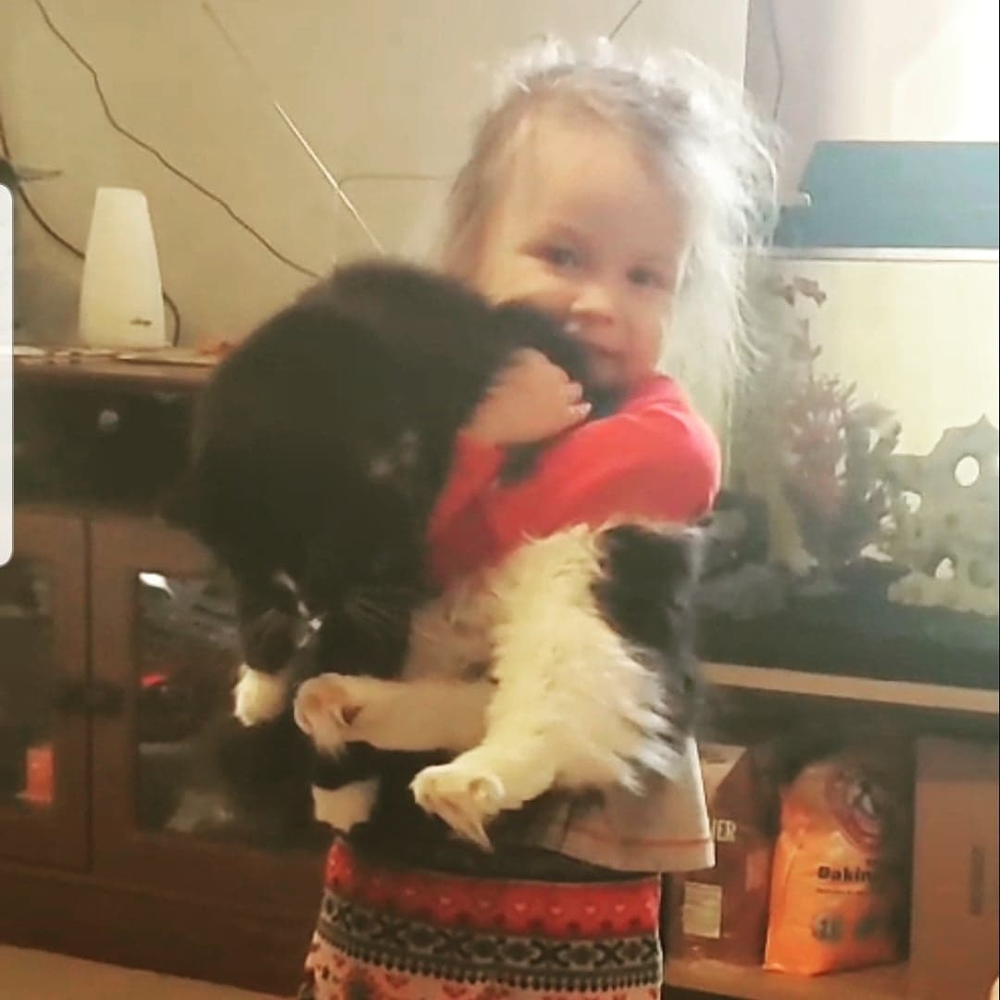

## Introduction

- I was born January 28, 1992 in Fairbury, Nebraska.
- I spent the first 18 years of my life living within 20 miles of Fairbury and attending Fairbury Public Schools.
- I have earned a BS in Mathematics from PSC and a MS in Mathematics from UNO.
- I am currently studying at UNL in the Statistics program pursuing a PhD in Statistics. I intend on taking my time completing my degree and I hope to graduate by May 2030.
- I also work full time teaching mathematics and statistics at PSC.


## Cat Person
{width=60%,height=60%}


## Favorite Plot

```{r,include=FALSE,echo=FALSE}
if (!"palmerpenguins" %in% installed.packages()) {
  remotes::install_github("allisonhorst/palmerpenguins")
}
library(palmerpenguins)
library(ggplot2)
library(grDevices)


```

```{r penguin-plot,echo=FALSE, fig.cap="Ugly Graph", warning=FALSE}

ggplot(penguins, aes(x = body_mass_g, y = bill_length_mm, color = species)) + 
  geom_point(shape="P", size=10)+ scale_color_manual(values=c("#8915E2", "#E21590", "#E215D4"))+ theme(text=element_text(family="mono",size=6),
  panel.background = element_rect(fill = "#B215E2", colour = "#FF8000",size=1,linetype = "solid"),panel.grid.major = element_line(size = .5, linetype = 'dotted',colour = "#FF8000"),panel.grid.minor = element_line(size = 0.25, linetype = 'dashed',colour = "#FF8000"))+ labs(title = "Ugly Penguin Graph",subtitle = "Created by Cassie Tangen")

```


## CV Link
[Cassandra Tangen CV](https://ctangen28.github.io/CTangenCV/main.pdf)
